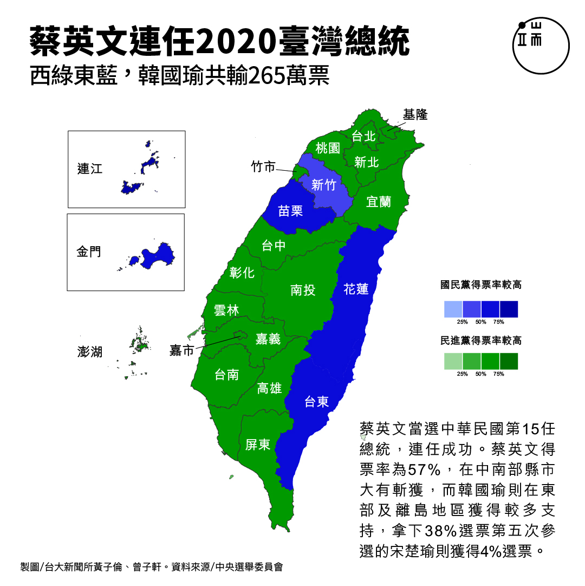
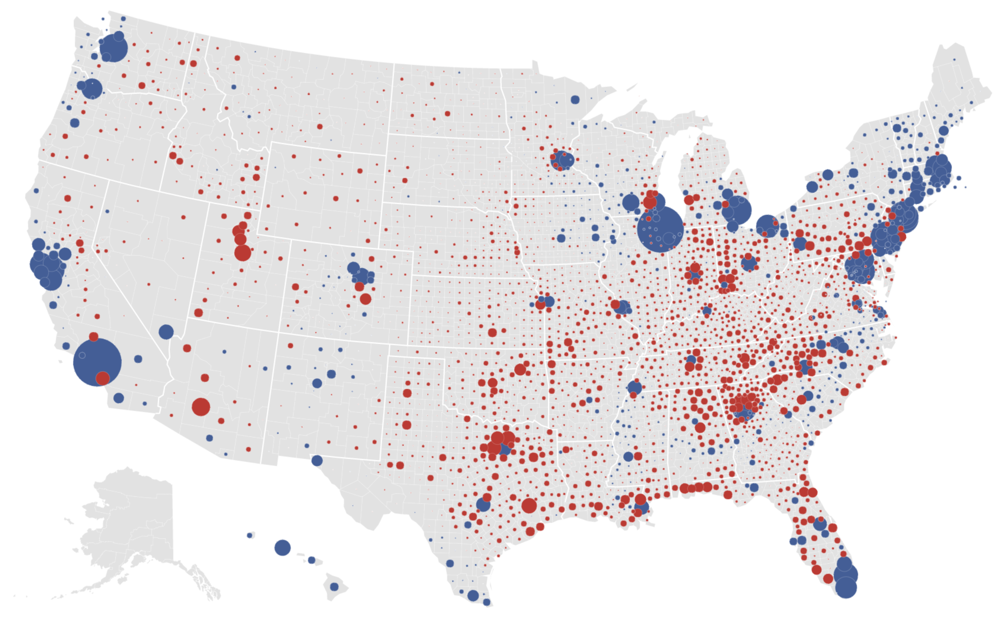
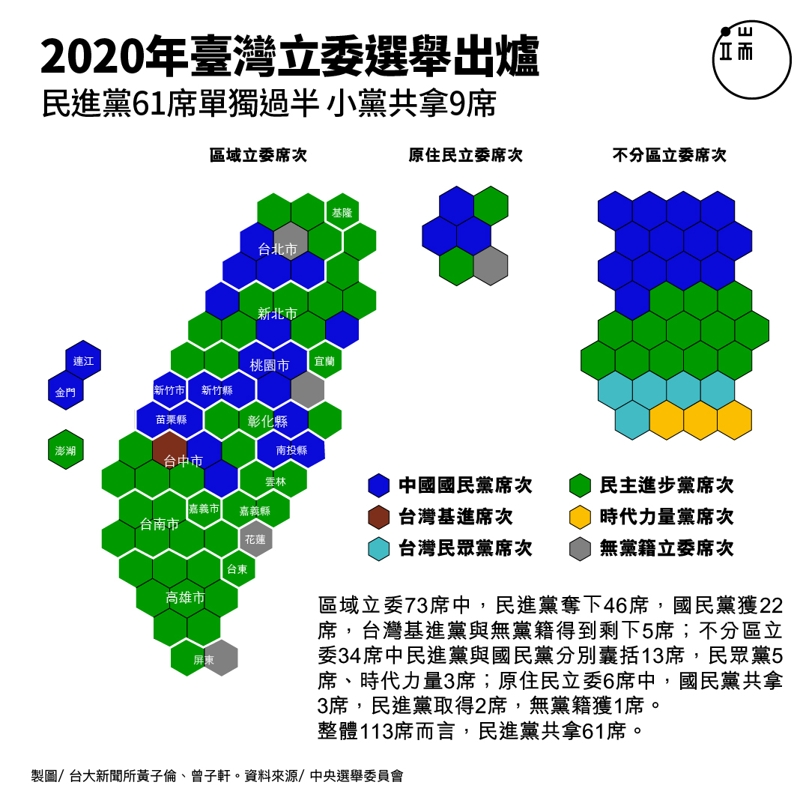
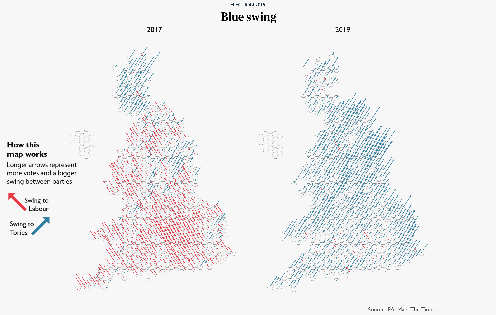
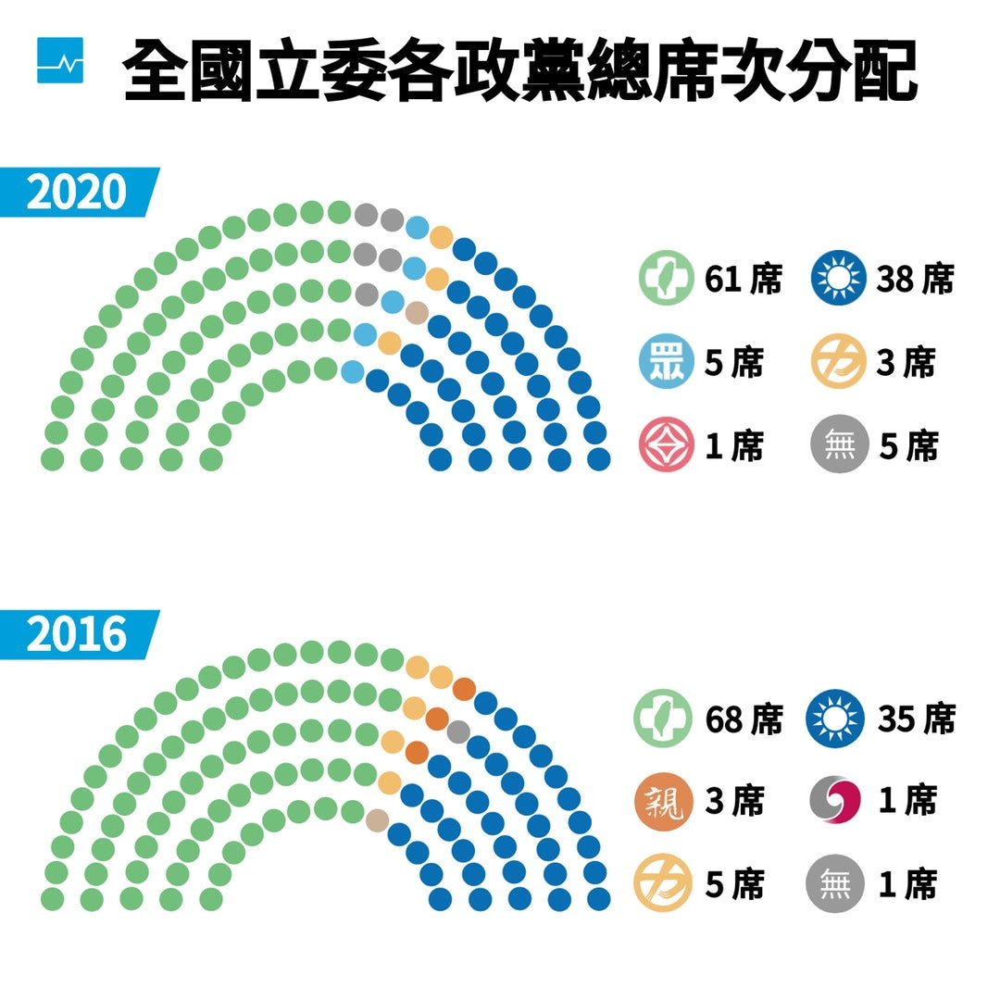
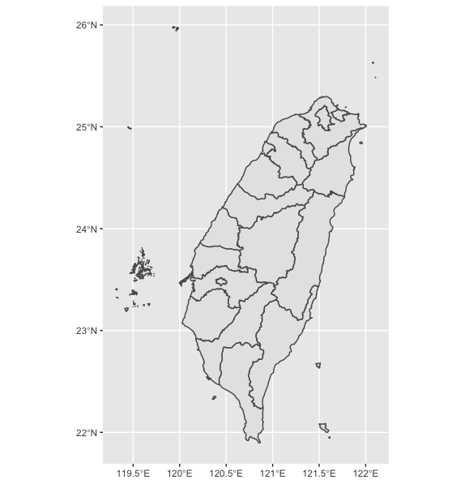
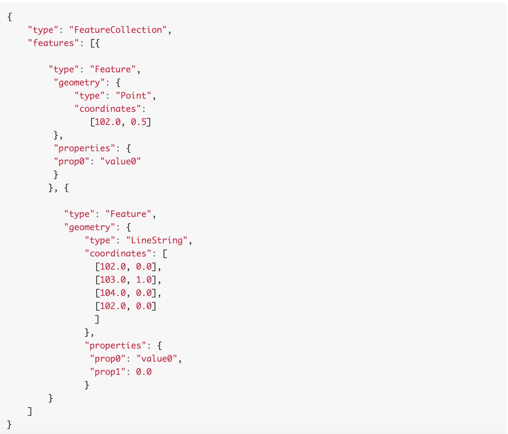
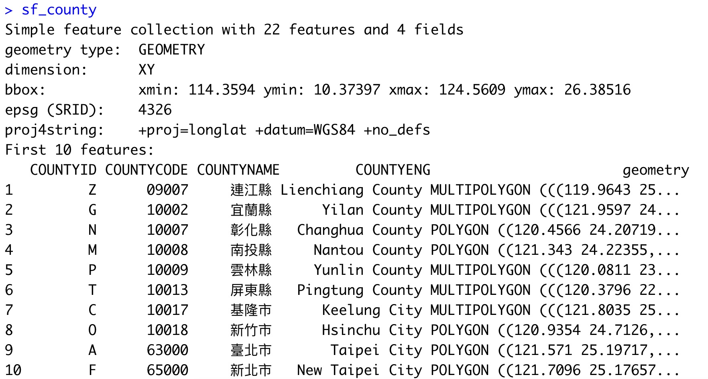

<style type="text/css">
.remark-slide-content {
    font-size: 28px;
    padding: 1em 2em 1em 2em;
}

.my-one-page-font {
  font-size: 10px;
}
</style>

# Self Introduction

<ul>
<li>Background
    <ul>
    <li>NTU Business Administration</li>
    <li>Yahoo Taiwan CRM Analytics Intern</li>
    </ul>
<li>Interest
    <ul>
    <li>Data Analyst Track</li>
    <li>Data Journalist Track</li>
    </ul>
<li>R
    <ul>
    <li>package: dplyr, tidyr, purrr, ggplot2, shiny</li>
    <li>data importing, cleaning, manipulation, visualization; social network; data mining, text mining</li>
    </ul>
<li>More
    <ul>
    <li><a href="https://medium.com/dennis-r-data-news" target="_blank">My Medium</a></li>
    <li><a href="https://dennisrdatanews.netlify.com/">My Blog</a></li>
</li>
</ul>

---

# Agenda

<ul>
<li>Map
    <ul>
    <li>背景地圖/Background Map</li>
    <li>統計地圖/Choropleth</li>
    <li>點示地圖/Dot Distribution Map; Bubble Map</li>
    <li>示意地圖/Cartogram</li>
    <li>六邊型網格圖/Hexmap/Tilegram</li>
    <li>國會席次圖/Parliament Plots</li>
    </ul>
<li>Non-Map
    <ul>
    <li>散點圖/Scatterplot</li>
    <li>堆疊長條圖/Stacked Bar Plot</li>
    <li>折線子圖/Facet Line Plot</li>
    <li>美化圖表/Aesthetic specifications</li>
    </ul>

---
# Nice Work: Map

```{r image_map01, out.width='45%', out.height='45%',echo=FALSE}

knitr::include_graphics("image/viewsoftheworld_cartogram.png")
```

.pull-left[Taiwan 2020 Presidential Choropleth by [端傳媒](https://theinitium.com/article/20200112-taiwan-election-data-ntu/)]

.pull-right[US 2016 Presidential Vote Share Map by [Views of the World](http://www.viewsoftheworld.net/wp-content/uploads/2016/11/USelection2016Cartogram.png)]
---
# Nice Work: Map

```{r image_map02, out.width='45%', out.height='45%',echo=FALSE}


```

.pull-left[US 2012 Presidential Vote Lead Map by [The New York Times](https://www.nytimes.com/interactive/2016/11/01/upshot/many-ways-to-map-election-results.html)]

.pull-right[Taiwan 2020 Parliament Hexmap by [端傳媒](https://theinitium.com/article/20200112-taiwan-election-data-ntu-1/)]

---
# Nice Work: Map

```{r image_map03, out.width='50%', out.height='50%',echo=FALSE}


```
.pull-left[UK 2019 Parliament Swing Map by [TeHuia](https://www.reddit.com/r/MapPorn/comments/eah5j1/uk_2019_election_swing_map/)]

.pull-right[Taiwan 2020 Parliament Plot by [關鍵評論網](https://www.thenewslens.com/article/129934)]
---

# Data

<ul>
<li>Taiwan 2020 Election Results
    <ul>
    <li>Presidential Election</li>
    <li>Parliament Election</li>
    </ul>
<li>NTU Student Congress Election & Attedance
    <ul>
    <li>Vote</li>
    <li>Attendance</li>
    </ul>
</ul>
---

# Map: Background Map

```{r image_geo_example, out.width="70%", out.height="70%", echo=FALSE}

```
---

# Geographical Data in R

<ul>
<li>GeoJSON
    <ul>
    <li>A format based on JS Object Notation, designed for representing geographical features as well as their non-spatial attributes.</li>
    <li>The features include points, line strings, polygons, and multi-part collections of these types.</li>
    <li><a href="https://cran.r-project.org/web/packages/geojsonR/vignettes/the_geojsonR_package.html" target="_blank">Processing of GeoJSON data in R</a></li>
    <li>library(geojsonR)</li>
    </ul>
<li>Simple Feature
    <ul>
    <li>sf, the table (data.frame) with feature attributes and feature geometries.</li>
    <li><a href="http://r-spatial.github.io/sf/articles/sf1.html" target="_blank">Simple Features for R</a></li>
    <li>library(sf)</li>
    </ul>
</ul>

---
# Geographical Data in R: GeoJSON

```{r image_geojson, out.width='85%', out.height='85%',echo=FALSE}

```

---
# Geographical Data in R: sf

```{r image_sf, out.width='95%', out.height='95%',echo=FALSE}

```
---

# Geographical Data: Taiwan - shp

<ul>
<li>Process
    <ul>
    <li>Download raw data: shp</li>
    <li>Simplify shapefile with mapshaper</li>
    <li>Import shapefile with library(sf)</li>
    </ul>
<li>Links
    <ul>
    <li><a href="https://data.gov.tw/dataset/7442" target="_blank">直轄市、縣市界線(TWD97經緯度)</a></li>
    <li><a href="https://mapshaper.org/" target="_blank">mapshaper</a></li>
    <li><a href="https://www.facebook.com/imDataMan/posts/1849991925279765" target="_blank">
Data Man 的資料視覺化筆記介紹 mapshaper</a></li>
    </ul>
</ul>
    
---

# Geographical Data: Taiwan - geojson

<ul>
<li>Process
    <ul>
    <li>Download raw data: geojson</li>
    <li>Import shapefile with library(geojsonio)</li>
    </ul>
<li>Links
    <ul>
    <li><a href="https://github.com/codeforamerica/click_that_hood/blob/master/public/data/taiwan.geojson">taiwan.geojson</a></li>
    <li><a href="https://medium.com/@imandylin2_38094/%E5%A4%A9%E4%B8%8B%E9%9B%9C%E8%AA%8C2018%E5%8F%B0%E7%81%A3%E9%81%B8%E8%88%89%E5%9C%B0%E5%9C%96%E8%A3%BD%E4%BD%9C%E5%88%86%E4%BA%AB-%E6%8A%80%E8%A1%93%E7%9A%84%E9%83%A8%E5%88%86-de82c38da77b" target="_blank">
Building 2018 Taiwan Election Map by 林佳賢</a></li>
    </ul>
</ul>

---

class: inverse, center, middle

# R time: Background Map

---

# Map: Choropleth

<ul>
<li>Definition
    <ul>
    <li>A choropleth map displays divided geographical areas or regions that are coloured in relation to a numeric variable.</li>
    <li><a href="https://www.r-graph-gallery.com/choropleth-map.html">Choropleth Map by the R Graph Gallery</a></li>
    </ul>
<li>Process
    <ul>
    <li>Get Taiwan 2020 Election Results Data</li>
    <li>Decide the variables plotted</li>
    <li>Join Election with Taiwan sf object</li>
    <li>Plot and Adjust</li>
    </ul>
</ul>

---

class: inverse, center, middle

# R time: Choropleth

---

# Map: Dot Distribution Map/Bubble Map

<ul>
<li>Definition
    <ul>
    <li>Choropleths aggregate individual data points into a single geographic region. In contrast, a dot distribution/density map uses a dot symbol to show the presence of a feature or a phenomenon.</li>
    <li><a href="https://www.r-graph-gallery.com/bubble-map.html">Bubble map by the R Graph Gallery</a></li>
    </ul>
<li>Process
    <ul>
    <li>Get Taiwan 2020 Election Results Data</li>
    <li>Decide the variables plotted</li>
    <li>Join Election with Taiwan sf object</li>
    <li>Plot and Adjust</li>
    </ul>
</ul>

---

class: inverse, center, middle

# R time: Choropleth

---

# Map: Dot Distribution Map/Bubble Map

<ul>
<li>Definition
    <ul>
    <li>Choropleths aggregate individual data points into a single geographic region. In contrast, a dot distribution/density map uses a dot symbol to show the presence of a feature or a phenomenon.</li>
    <li><a href="https://www.r-graph-gallery.com/bubble-map.html">Bubble map by the R Graph Gallery</a></li>
    </ul>
<li>Process
    <ul>
    <li>Get Taiwan City Population Data</li>
    <li>Plot and Adjust</li>
    <li>Comparison: geom_sf() vs. geom_polygon()</li>
    </ul>
</ul>

---

class: inverse, center, middle

# R time: Dot Distribution Map/Bubble Map

---

# Map: Cartogram

<ul>
<li>Definition
    <ul>
    <li>A cartogram is a map in which the geometry of regions is distorted in order to convey the information of an alternate variable.</li>
    <li><a href="https://www.r-graph-gallery.com/cartogram.html">Cartogram by the R Graph Gallery</a></li>
    </ul>
<li>Process
    <ul>
    <li>Get Taiwan 2020 Election Results Data</li>
    <li>Decide the variables plotted</li>
    <li>Join Election with Taiwan sf object</li>
    <li>Plot and Adjust</li>
    </ul>
</ul>

---

class: inverse, center, middle

# R time: Cartogram

---

# Map: Hexmap

<ul>
<li>Definition
    <ul>
    <li></li>
    <li><a href="https://www.r-graph-gallery.com/bubble-map.html">Bubble map by the R Graph Gallery</a></li>
    </ul>
<li>Process
    <ul>
    <li>Get Taiwan 2020 Election Results Data</li>
    <li>Decide the variables plotted</li>
    <li>Join Election with Taiwan sf object</li>
    <li>Plot and Adjust</li>
    </ul>
</ul>

---

class: inverse, center, middle

# R time: Hexmap

---

# Map: Parliament Plots

<ul>
<li>Definition
    <ul>
    <li>A visual representations of the composition of legislatures that display seats colour-coded by party.</li>
    <li><a href="https://github.com/RobWHickman/ggparliament">ggparliament by RobWHickman</a></li>
    <li><a href="https://erocoar.github.io/ggpol/">ggpol by Frederik Tiedemann</a></li>
    </ul>
<li>Process
    <ul>
    <li>Get Taiwan 2020 Parliament Raw Data</li>
    <li>Create x, y, and theta columns</li>
    <li>Plot Parliament Composition</li>
    </ul>
</ul>

---

class: inverse, center, middle

# R time: Parliament Plots

---

# Map: Summary

<ul>
<li>Plots
    <ul>
    <li>背景地圖/Background Map</li>
    <li>統計地圖/Choropleth</li>
    <li>點示地圖/Dot Distribution Map; Bubble Map</li>
    <li>示意地圖/Cartogram</li>
    <li>六邊型網格圖/Hexmap/Tilegram</li>
    <li>國會席次圖/Parliament Plots</li>
    </ul>
<li>Process
    <ul>
    <li>Get Taiwan 2020 Election Results Data</li>
    <li>Decide the variables plotted</li>
    <li>Join Election with Taiwan sf object</li>
    <li>Plot and Adjust</li>
    </ul>
</ul>

---

class: inverse, center, middle

# 休息一下/Intermission

---

# Non-Map: Visualizing NTU Student Congress Vote Rate and Attendance Rate

<li>Plots
    <ul>
    <li>Stacked Bar Plots</li>
    <li>Scatterplot</li>
    <li>Facet Line Plot</li>
    </ul>
<li>Data
    <ul>
    <li>NTU Student Congress</li>
    <li>Election: Vote Rate</li>
    <li>Congress: Attedance Rate</li>
    <li>Variable: Grade, College, Term</li>
    </ul>
</ul>

---

# Non-Map: Three Topics
<ul>
<li>Election: Vote Rate
<li>Congress: Attedance Rate
<li>Vote Rate & Attendance Rate
</ul>

---

class: inverse, center, middle

# R time

---

# Further
<li>Books
    <ul>
    <li><a href="https://bookdown.org/robinlovelace/geocompr/adv-map.html" target="_blank">My Medium</a></li>
    <li><a href="https://bookdown.org/tpemartin/108-1-ntpu-datavisualization/" target="_blank">My Medium</a></li>
    </ul>
</ul>


---

class: inverse, center, middle

# Thanks 

---